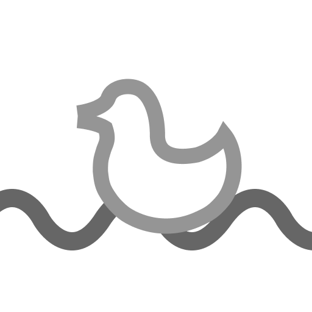

# River



River is a fast and simple ECS made specifically with data in mind.
Make your games faster and easier to manage. It has a simple syntax and lets you use Luau type system. River gets your data right when you want it.


Read more here: https://HawDevelopment.github.io/River/

---

Heres some examples!
Create some data first!

```lua
local Component = River.Component
local Type = River.Type
local Entity = River.Entity

local MyComponent = Component({
    Name = Type("string"),
    Age = Type("number"),
})

local MyEntity = Entity({
    Person = MyComponent({
        Name = "Dave",
        Age = 69,
    }),
})
```

Change some data!

```lua
local System = River.System
local Query = River.Query

local MyQuery = Query(MyComponent)

local MySystem = System(function(query)
    for _, entity in pairs(query) do
        entity.Person.Age += 1
    end
end)
MySystem:add(MyQuery)
```

Call the system!

```lua
MySystem:call()

-- OR

local World = River.World

local MyWorld = World()
MyWorld:add(MySystem, "update")
MyWorld:start()
```
